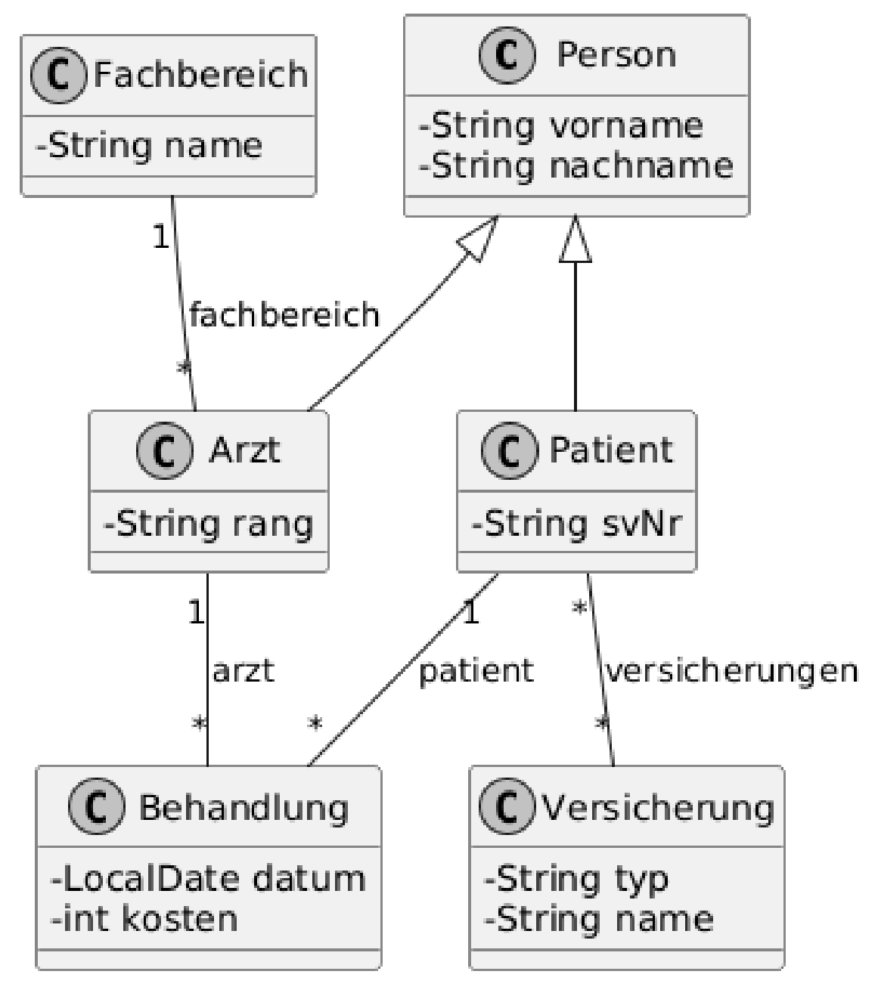

## $\scriptsize\underline{\texttt{⒉ {Test}} \quad \color{#99bb77c8}{\text{ Datenbank- und Informationssysteme } \quad {\scriptsize{2026}}}}$

$${\large{\underline{\text{Kapitel:} \LARGE{\color{#99bb7798}\texttt{ JPA2 }}}}}$$

---

### Krankenhaus-Datenmodell auf Basis von $\color{#33333366}\underline{\texttt{JPA2}}$

| ⚠️ *Ausschließlich die mit der Testangabe im Moodle zur Verfügung gestellten Folien sind als Hilfsmittel zugelassen!*   $\quad$ **→ die Verwendung von <mark>KI</mark>** (z.B. KI Auto Completion) **ist <mark>explizit untersagt!</mark>** |
| :--- |

#### Allgemeine Beschreibung

<table style="margin-left: 4rem; width: 90%; font-size: 0.8em">
  <tr>
    <td>
      <b>Es soll das Datenmodell eines Krankenhauses mittels JPA2 abgebildet werden.</b>
    </td>
    <td>
      <b>Die genauen Details entnehmen Sie bitte folgendem UML-Klassendiagramm:</b>
    </td>
  </tr>
  <tr>
    <td>
      <ul>
        <li> Es soll das Datenmodell eines Krankenhauses mittels JPA2 abgebildet werden.
      </ul>
    </td>
    <td align="center">
      
    </td>
  </tr>
</table>

---

#### 1 JPA2-Entitäten

#### 1.1 Objektmodell

- Erweitern Sie die gegebenen Java-Klassen so, dass diese als Entitäten gespeichert und
  geladen werden können und führen Sie die dazu notwendigen Konfigurationsschritte aus.
- Bilden Sie die im UML-Diagramm dargestellten Beziehungen aus und annotieren Sie diese
  entsprechend. Achten Sie dabei auf die Direktionalität der Beziehung. Weiters sollen
  Assoziativtabellen soweit als möglich vermieden werden.
- Setzen Sie die gegebenen Testdaten sinnvoll in Beziehung und persistieren Sie diese.

#### 1.2 Erweiterte Annotationen

- Beim Persistieren eines Patienten sollen auch automatisch alle damit in Beziehung
  stehenden Behandlungen gespeichert werden.
- Der Vorname von Personen soll nur max 32 Zeichen lang sein dürfen

#### 2 JPQL Query / NamedQuery

- Erstellen Sie die im Folgenden genauer beschriebenen Abfragen in JPQL und geben Sie die
  Ergebnisse mittels der Methode printResultList() aus.
- Selektieren Sie mittels Query ...
  - Alle Patienten
  - Alle Behandlungen, die vom Arzt Gruber durchgeführt wurden
  - Alle Patienten, die von Ärztin Huber behandelt wurden.
  - Alle Behandlungen, die für Patient Schmidt durchgeführt wurden. Der Patient soll als ganze
    Entität per Named Parameter übergeben werden.
- Erstellen Sie eine NamedQuery ...
  - Versicherung.noOfCustomers: Alle Versicherungen, die mehr als 2 Patienten haben.
    Übergabe der Patientenanzahl mittels Named Parameter.
  - Behandlung.costsMoreThan: Alle Behandlungen, deren Kosten 100 übersteigen - wobei die
    Kosten als Positional Parameter übergeben werden sollen.
  - Patient.bySVNR: Lädt einen Patienten anhand seiner SVNR, wobei seine Behandlungen
    bereits durch die Query initialisiert sein sollen.
