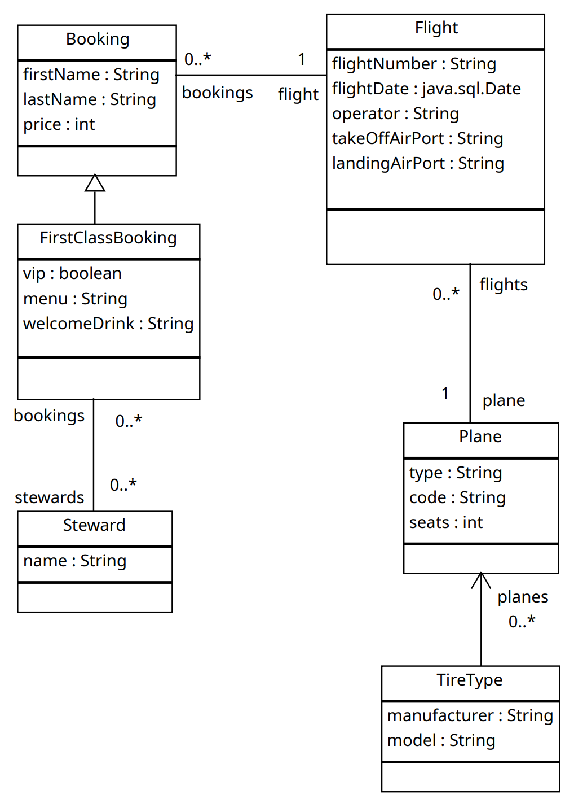

## $\scriptsize\underline{\texttt{⒉ {Test}} \quad \color{#99bb77c8}{\text{ Datenbank- und Informationssysteme } \quad {\scriptsize{2026}}}}$

$${\large{\underline{\text{Kapitel:} \LARGE{\color{#99bb7798}\texttt{ JPA2 }}}}}$$

---

### Buchungssystem für Flüge auf Basis von $\color{#33333366}\underline{\texttt{JPA2}}$

| ⚠️ *Ausschließlich die mit der Testangabe im Moodle zur Verfügung gestellten Folien sind als Hilfsmittel zugelassen!*   $\quad$ **→ die Verwendung von <mark>KI</mark>** (z.B. KI Auto Completion) **ist <mark>explizit untersagt!</mark>** |
| :--- |

#### Allgemeine Beschreibung

<table style="margin-left: 4rem; width: 90%; font-size: 0.8em">
  <tr>
    <td>
      <b>Für eine Fluglinie soll ein Buchungssystem mittels JPA2 realisiert werden:</b>
    </td>
    <td>
      <b>Die genauen Details entnehmen Sie bitte folgendem UML-Klassendiagramm:</b>
    </td>
  </tr>
  <tr>
    <td>
      <ul>
        <li> Eine wichtige Entität dieses Buchungssystems ist der Flug (Flight).
        <li> Einem Flug sind genau ein Flugzeug (Plane) sowie typischerweise mehrere Buchungen (Booking) zugeordnet.
        <li> Zusätzlich ist noch über eine unidirektionale Beziehung TireType → Plane festgehalten, welches Flugzeug welchen Reifentyp benötigt.
        <li> Es gibt normale Buchungen (Booking), sowie Buchungen in der ersten Klasse (FirstClassBooking).
        <li> Eine Buchung erster Klasse zeichnet sich dadurch aus, dass ihr mehrere Stewards fix zugeordnet werden können, welche den/die Reisende/n persönlich betreuen.
      </ul>
    </td>
    <td align="center">
      
    </td>
  </tr>
</table>

---

  
  

#### 1 Daten / Objektmodell

#### 1.1 Objektmodell persistieren

- Erweitern Sie die gegebenen Java-Klassen so, dass diese als Entitäten gespeichert und geladen werden können und führen Sie die dazu notwendigen Konfigurationsschritte aus.
- Bilden Sie die im UML-Diagramm dargestellten Beziehungen aus und annotieren Sie diese entsprechend. Achten Sie dabei auf die Direktionalität der Beziehung. Weiters sollen Assoziativtabellen soweit als möglich vermieden werden.
- Setzen Sie die gegebenen Testdaten sinnvoll in Beziehung und persistieren Sie diese.

#### 1.2 Erweiterte Annotationen

- Die Membervariable „operator“ der Entität Flight soll in der Datenbankspalte „flightoperator“ gespeichert werden.
- Beim Persistieren eines Flugs sollen auch automatisch alle damit in Beziehung stehenden Buchungen gespeichert werden.

#### 2 JPQL Query / NamedQuery

- Erstellen Sie die im Folgenden genauer beschriebenen Abfragen in JPQL und geben Sie die
- Ergebnisse mittels der Methode printResultList() aus.
- Selektieren Sie mittels Query ...
  - alle Steward-Entitäten
  - jene Flüge (Flight), die mit Flugzeugen (Plane) durchgeführt wurden, die mehr als 200 Sitzplätze (seats) aufweisen
  - jene Buchungen (Booking), deren Preis (price) > 400 ist.
- Dabei sollen zugeordnete Flight-Entitäten mittels Fetch-Join innerhalb der selben Abfrage geladen/initialisiert werden
  - Alle Buchungen (Booking), die auf Alice Smith lauten.
- Vor- und Nachname sollen per NamedParameter an die Query übergeben werden Erstellen Sie eine NamedQuery ...
  - Klasse Flight, Name „Flight.lessThanTwoBookings“: jene Flight-Entitäten, die weniger als 2 Buchungen haben
  - Plane, Name „Plane.findByPType“: jene Plane-Entitäten, die den angegeben pType aufweisen, der mittels Positional Parameter übergeben werden soll
  - Klasse TireType, Name „TireType.findForPlane“: jene TireType-Entitäten, die für ein per NamedParameter übergebenes Flugzeug (Plane) passen

<!--
  ∶ ► ▻ ▶ ▢ ▬ ▪ ▫ ⫶ ⫦ ⫣ ⫍ ⫎ ⫞ ⫸ ⫷ ⫬ ⫭ ⫣ ⫦ ⩸ ⨽ ⨯
  ⑵ ⒉ ② ⌗ ⌖ ⋯ ⋕ ⋄ ⋆ ⊺ ⊦ ⊨ ⊰ ⊱ ⊢ ⊛ ⊘ ∾ ∼ ∗ ∘ ∎ ₂ ² ⅟ □ ■ ◻ ■ ◯ ○ ◌ ◉
  ☆*: .｡. o(≧▽≦)o .｡.:*☆
  ╰(*°▽°*)
  ╯(*/ω＼*)
  (～￣▽￣)～
  ( •̀ ω •́ )✧
  ヾ(＠⌒ー⌒＠)ノ
  ㄟ(≧◇≦)ㄏ
  o((>ω< ))o
  (≧∀≦)
  ゞ(oﾟvﾟ)ノ
  ♪(´▽｀)
  o(*￣▽￣*)o
  ƪ(˘⌣˘)ʃ
  ヾ(•ω•`)
  o(*￣3￣)
  ╭(￣o￣) . z Z
  (づ￣ 3￣)づ
  (～﹃～)~zZ
  (๑•̀ㅂ•́)و✧ ( ﾟдﾟ)つ Bye
  ( •̀ .̫ •́ )
  ✧♪(´▽｀)
  Ψ(￣∀￣)Ψ
  ＼(ﾟｰﾟ＼)
  ヾ(⌐■_■)ノ♪
  -->
